# <center>科研训练项目结题报告</center>

## <center>智能云相册平台</center>

### <div style="margin-left:30%"> 项目类别：<u>校级项目</u></div>

### <div style="margin-left:30%"> 项目单位：<u>计算机科学与工程学院</u></div>

### <div style="margin-left:30%"> 项目成员：<u>hzj、ky、cjy</u></div>

### <div style="margin-left:30%"> 指导教师姓名：<u>ylg</u></div>

### <div style="margin-left:30%"> 起止时间：<u>2021-04-01 至 2022-09-30</u></div>

---

## 1引言

### 1.1研究背景

照片是现代年轻人记录生活点滴的一种主流方式，然而当需要保存的照片越来越多时，有限的设备内存或多或少就会成为一种阻碍。并且当人们需要更换设备时，原设备上的照片拷贝进新设备也是一件麻烦事。

因此，在科技发展的时代洪流下，云相册应运而生。云相册，顾名思义就是将手机等设备中的照片上传到网络上，从而起到不占用内存空间并且同步到每个设备随时查看的作用，只要有网络，无论是走在路上还是坐在电脑前，都能通过云相册轻松获取照片、快速分享。

### 1.2研究目标

本项目的目标是采用web应用程序、人脸识别、图像识别等技术，针对市场审美以及功能需求，设计一款面向大众用户的智能云相册产品，专注于影像文件存储和管理，支持对图像内容进行自动识别分类、人脸识别等AI智能分析，提提供自动化剪辑制作功能，并基于Python、JavaScript和HTML5语言，进行整个软件的开发。

### 1.3研究意义

本研究主要是面向年轻的网络用户，构建一款免费、功能多样的云相册，主要目的是在此过程中加深对web应用程序开发实践经历，并且接触使用图像识别技术，熟练运用python语言等。

### 1.4研究方法

#### 1.4.1技术原理研究

（一）研究图像识别技术dlib与Transformer

1. 对dlib实现过程的原理的研究
   
   Dlib是较流行的人脸识别的开源库，使用c++编写，里面包含了许多的机器学习算法，在python中也可以使用。Dlib保持着很好的更新节奏，文档也写得相当清晰，涉及到的资源都有标明在哪里下载，是一个优秀的人脸识别开源库。
2. 对Transformer模型的基本原理进行研究，并尝试对模型进行改进
   
   2017 年，Google在论文 [Attention is All you need](https://arxiv.org/abs/1706.03762) 中提出了 [Transformer](https://so.csdn.net/so/search?q=Transformer&spm=1001.2101.3001.7020) 模型，其使用 Self-Attention 结构取代了在NLP 任务中常用的 RNN 网络结构。相比 RNN 网络结构，其最大的优点是可以并行计算。

<center>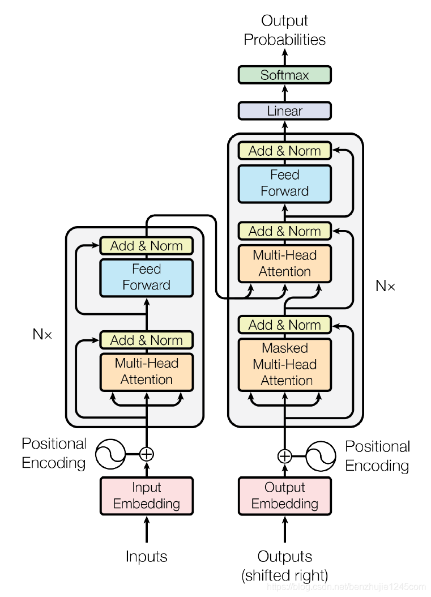</center>
<center>图1.1 Transformer 模型架构</center>

（二）实现人脸识别技术和图像识别接口，编写适用于课题的应用软件

#### 1.4.2技术实现

部分代码展示

```python
# 人脸比对函数
def face_compare_api(self, files):
    dist = []
    for file in files:
        temp = frombuffer(file, uint8)
        img = imdecode(temp, IMREAD_ANYCOLOR)
        # 转换rgb顺序的颜色。
        b, g, r = split(img)
        img2 = merge([r, g, b])
        # 检测人脸
        faces = self.detector(img, 1)
        if len(faces):
            for index, face in enumerate(faces):
                # # 提取68个特征点
                shape = self.shape_predictor(img2, face)
                # 计算人脸的128维的向量
                face_descriptor = self.face_rec_model.compute_face_descriptor(img2, shape)
                dist.append(list(face_descriptor))
        else:
            return None
    goal = self.dis_o(dist[0], dist[1])
    return 1 - goal

# 计算欧式距离函数
@staticmethod
def dis_o(dist_1, dist_2) -> float:
    dis = sqrt(sum((array(dist_1) - array(dist_2)) ** 2))
    return dis
```

## 2研究过程

### 2.1市场需求调查阶段

浏览各大应用市场相关软件的用户评论，对市场需求进行分析，对应用所解决的痛点进行定位，确认程序所需要具备的主要功能和衍生功能。

### 2.2算法准备阶段

1. 初步学习并了解相关图像识别算法及领域相关论文，大致确定了算法的基础模型，选用dlib完成人脸识别模块，选用基于Transformer的VOLO完成图像识别模块，完成了部分的代码的书写，并在老师的指导下，确定了模型的实现方向。
2. 通过分析课题要求，将系统功能模块初步划分，给出了合理的研发流程和资源要求，设计出了软件的整体框架，并完成了系统基本功能文档的编写。最后，在本阶段结束时，将所设计框架的电子稿与本阶段编写的源代码提交导师审核。

### 2.3前端开发阶段

1. 原型图确认
   进行整个项目前端界面的原型设计，定下最终的产品原型，原型图中涉及到app需要具备的功能，页面的放置等。
2. 页面设计
   根据确认后的原型图，将原型图进行拓展，确认整个UI的设计风格。

#### 2.3.1登录页面

左侧是产品logo和功能简述，右侧是用户登录的用户名密码输入框。必须在登录成功之后才能进入系统的主界面，输入错误就会提示请输入正确的用户名和密码！这时候要求重新输入，只有输入正确之后才能进入主界面。详情如下图所示：

<center>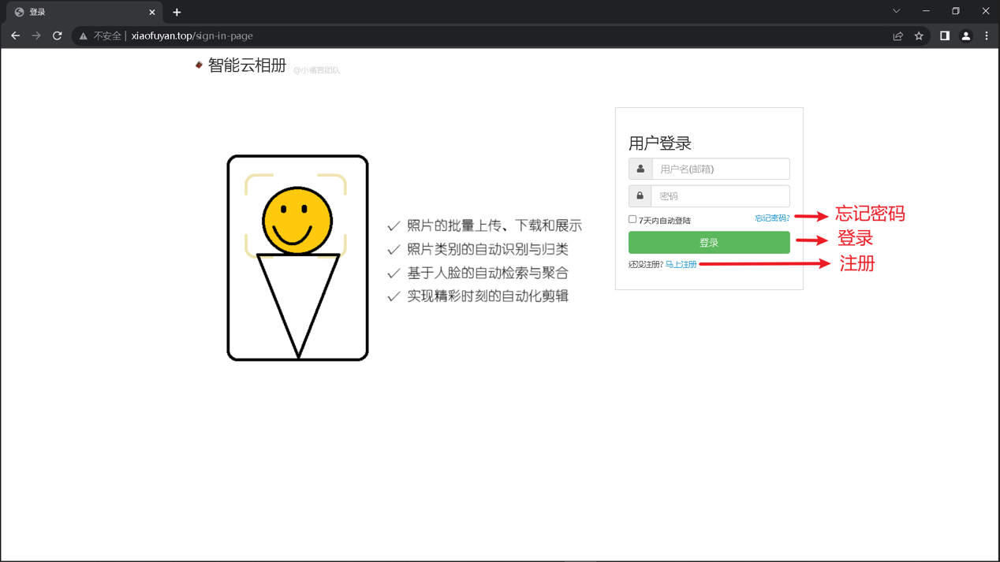</center>
<center>图2.1 系统登录页面</center>

#### 2.3.2用户主页

个人主页是承载了系统所有的功能模块，是系统的门面，通过首页，让用户更加直观的了解该系统的详情信息，加深用户的使用体验。然后用户可以看到系统的主要菜单和子菜单。同时也可以根据实际工作需要，在界面内进行相关的操作。

通过窗口，用户可以非常直观的了解到，系统的具体内容，针对实际的需求，在页面内，进行相应的功能设置。详细情况如下图所示：

<center>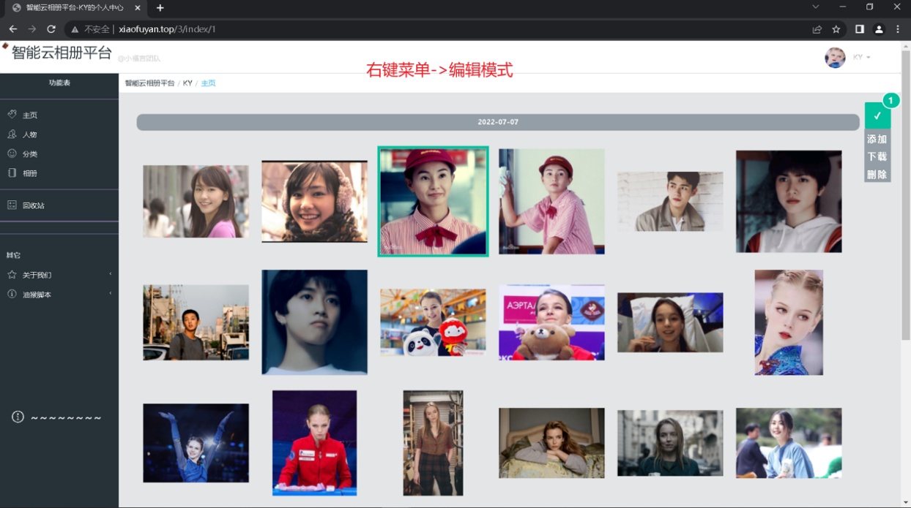</center>
<center>图2.2 个人主页页面</center>

<center>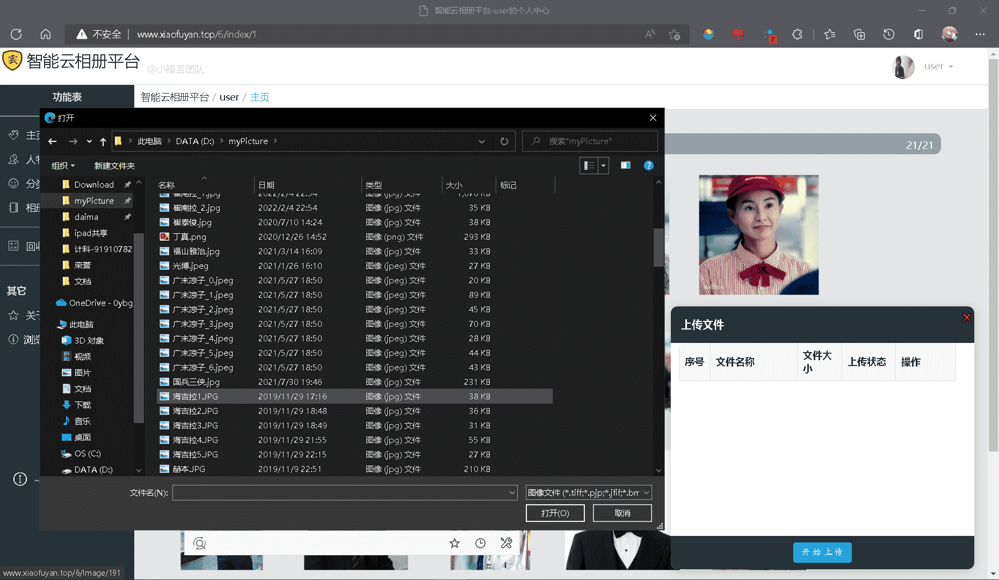</center>
<center>图2.3 上传图片功能</center>

#### 2.3.3图片详情页

在此页面内，用户可以清楚的查看到图片的详细信息，并对图片进行编辑操作————素描、手绘、磨皮等等，用户可根据实际的需求，在界面内进行对应的功能操作。详情如下图所示：

<center>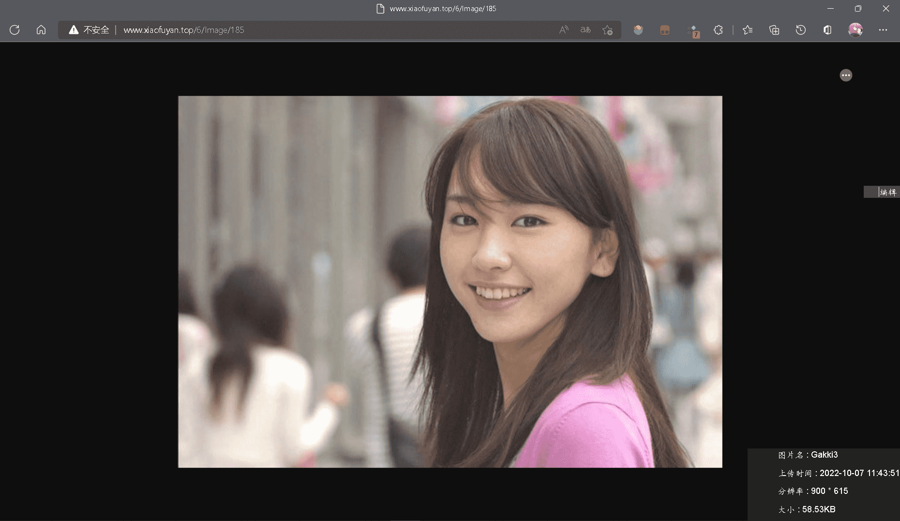</center>
<center>图2.4 图片信息</center>

<center>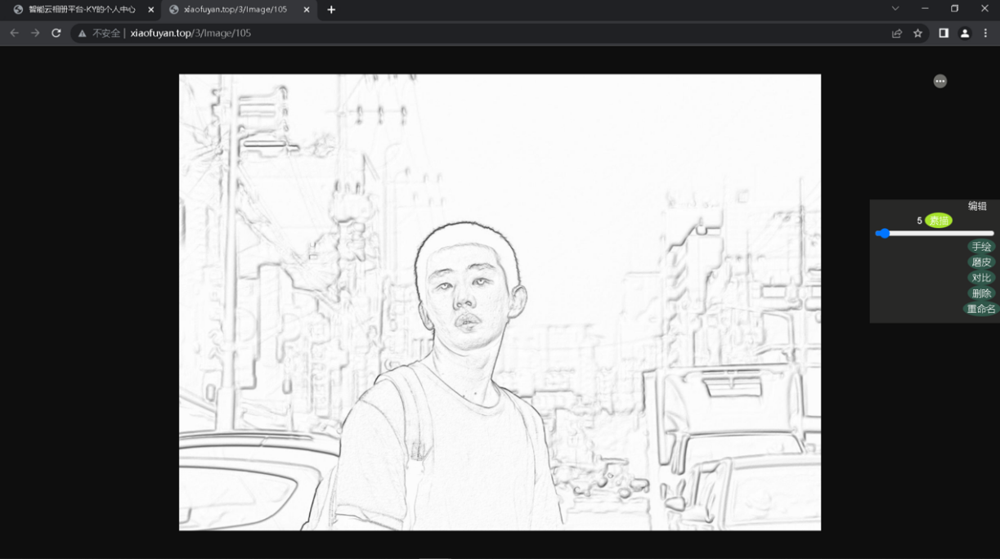</center>
<center>图2.5 素描功能</center>

<center>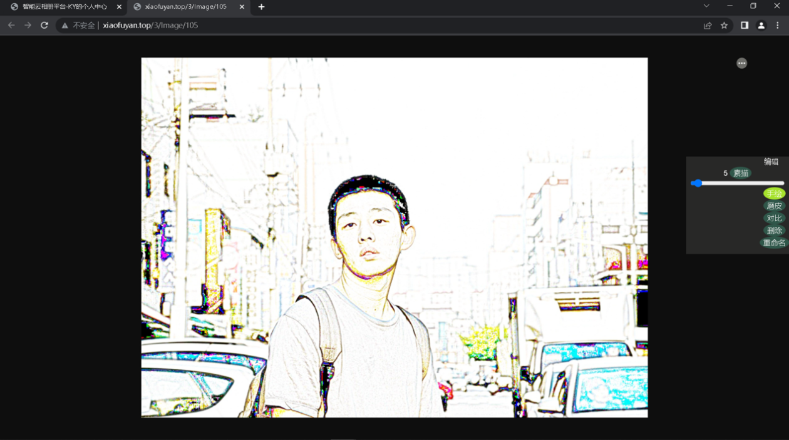</center>
<center>图2.6 手绘功能</center>

<center>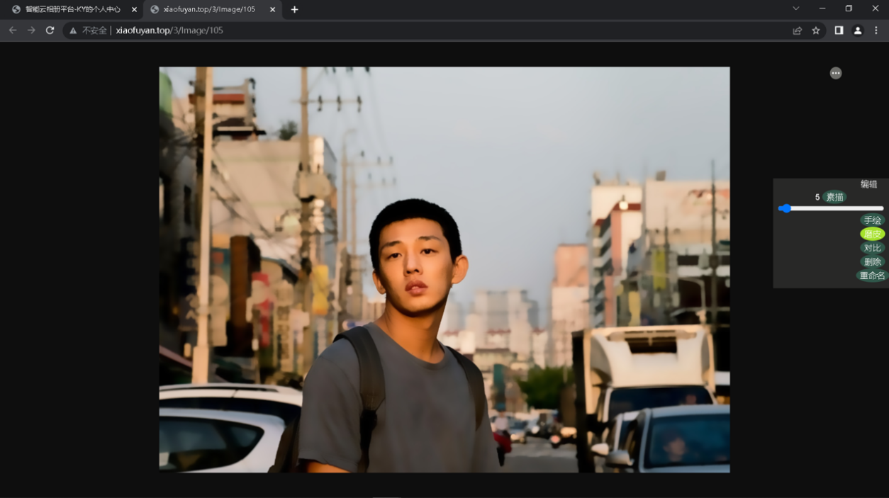</center>
<center>图2.7 磨皮功能</center>

#### 2.3.4分类页

服务器后台会自动对用户上传图片进行分类检测，详细页面如下：

<center>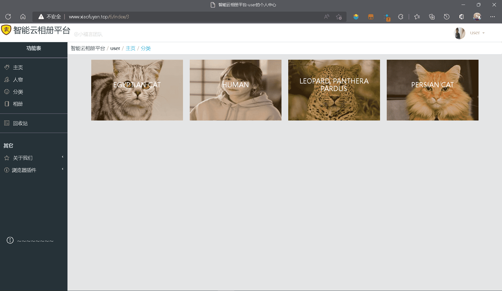</center>
<center>图2.8 总分类页</center>

<center>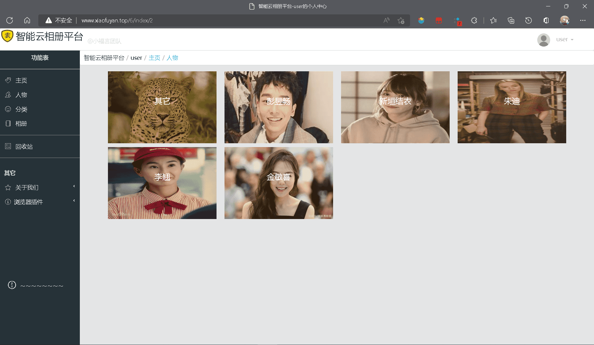</center>
<center>图2.9 人物分类页</center>

#### 2.3.5分类页编辑

通分类页编辑的界面用户可一目了然的了解到相关类别的信息，根据实际操作运行安排在系统中进行对应的编辑操作，用户点击相关的功能选项可以进行正确的功能信息查看，依照相关的指导规定进行实际操作。

通过窗口，用户可以非常直观的了解到，系统的具体内容，针对实际的需求，在页面内，进行相应的功能设置。详细情况如下图所示：

<center></center>
<center>图2.10 分类页编辑页面</center>

#### 2.3.6相册页

用户可以创建自定义相册并对其进行重命名操作，详细页面如下：

<center>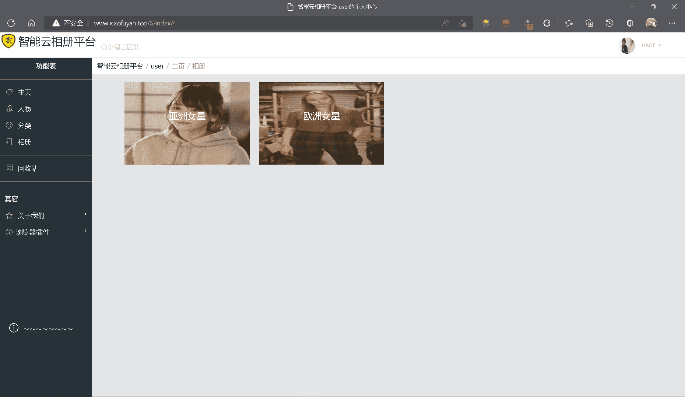</center>
<center>图2.11 相册页面</center>

#### 2.3.7插件使用

提供了网站配套浏览器插件，可实现直接从网页提取图片选择性上传至云服务器，详细信息如下：

<center>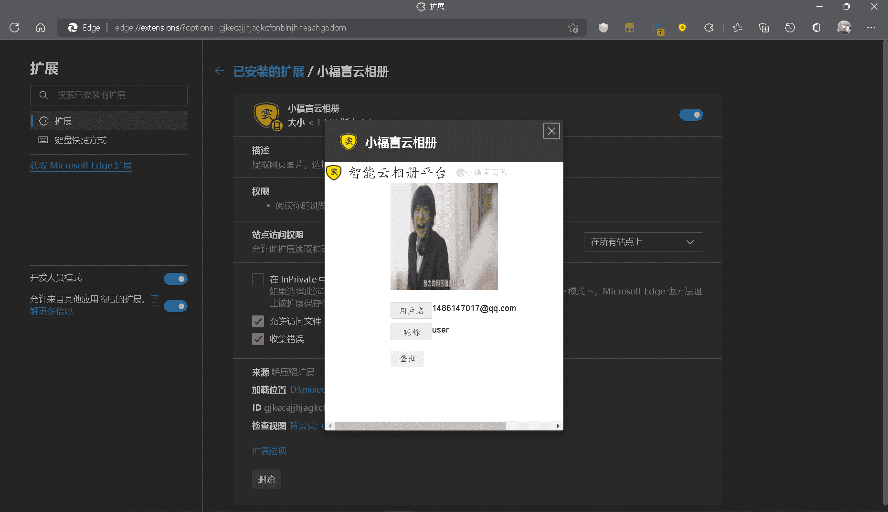</center>
<center>图2.12 插件登录</center>

<center>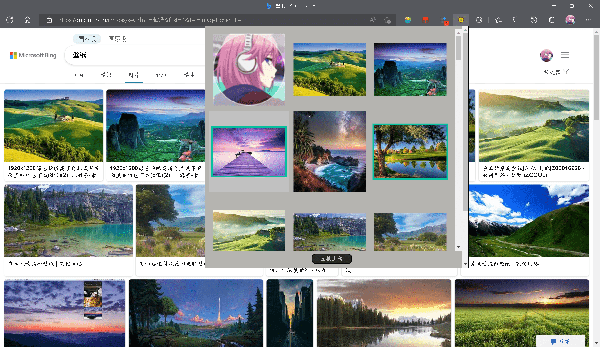</center>
<center>图2.13 上传图片</center>

### 2.4后端开发阶段

#### 2.4.1软件开发

1. 通过多次的小组会议完善修改程序，使程序初步成型。
2. 初步的实现并优化事件抽取模型，完成对算法的训练。
3. 完成了对初始数据集的自动化预处理，筛选出了更符合要求的数据集。
4. 成功完成了项目的整体开发——智能云相册。

#### 2.4.2软件完善

1. 对各部分细节进行完善以及对效果不理想的算法进行优化和修改。
2. 一步细化整个系统的流程。
3. 决了项目展示存在的问题，优化了展示页面，添加了更多的功能，并将项目部署到服务器。
4. 开发完成的软件成功申请了软件著作权。
5. 行项目收尾工作，为科研训练项目结题做准备。

## 3研究成果

### 3.1创新点

1. 界面清晰简洁
   登录界面由logo和账号密码输入框组成，进入首页左侧是功能栏，右侧是上传的图片。
2. 功能丰富多样
   包括云相册存储功能，智能图片识别自动分类功能，智能人脸识别分类功能，自动合成视频剪辑制作功能。
3. 准确率高
   图像分类模型采用基于Transformer的VOLO，精度高、速度快。

### 3.2成果

1. 相关模型和算法，并给出项目研究报告
2. 软件系统一套：部署到服务器
3. 专利成果：成品成功申请软件著作权

### 3.3演示视频

<video src="md/presentation.mp4"></video>


## 4问题与收获

### 4.1问题

1. 项目各部分之间的连接不够流畅
   本次科研训练项目共包含四个部分，分别是前端设计、后端设计、图像识别算法、部署服务器，因此我们在开展项目的过程中是按模块来分开实现，但这也导致在这四个模块之间的衔接上不够完善、并没有达到预想中，将整个项目流畅的串联起来的效果，导致用户体验不是很完美。
2. 功能较为扁平化
   所实现的功能与市面上部分成熟商业产品相比十分单一，且单个功能不够深入，浮于表面。
3. 用户界面
   展示不够完善，缺少动态效果，展示的方式比较单一、未能进行展示上的创新，这可能导致用户体验不佳。
4. 数据库
   未考虑对数据库并发操作，网站同一时刻访问量不宜过多。

### 4.2收获

学校开展科研训练百千万计划是一项非常有意义的计划，对我们本科生能力的提升有着非常显著的效果，同时能够更好的发挥我们本科生与老师的交流作用，促进同学们的成长成才。在这次科研训练活动中，指导老师付出了很多精力，最终带领我们顺利完成了科研训练项目的研究工作，非常感谢他对我们的帮助和指导。同时，这次科研训练的研究经历也加深了我们科研的认知，掌握了科研的基本方法，更使我们的专业技术水平得到了很大的提升。

**对科研认识的加深：** 通过本次科研训练，我们深刻地了解到了科研的艰辛，但同时也感受到了科研的魅力所在。研究的过程是曲折的，而且往往会在错误的路上走很远，最终又需要回到起点重新来过，但是当研究有了成果之后又是十分喜悦的，尤其是当自己的工作得到他人的认可时更是如此。

**科研方法的掌握：** 在本次科研训练的过程中，通过多次小组会议，讨论研究进度与成果，让我们受益颇深。我们学会了从论文中寻找答案，学会了站在前人的基础上做改进。对于一个问题的研究，不能单纯地靠自己去想，更要依托于他人的研究成果，或许自己的想法早已在前人的研究中有了更深刻的解释。做科研就是要学会分析已有的研究中存在的不足之处，提出自己的改进方法，或者是将研究中提出的技术进行迁移拓展，使之在本研究问题上展现出更好的效果。

**专业水平的提升：** 加深了我们对图像识别工具的认知，掌握了更丰富的cv库，能够更加熟练的使用各种编程语言，更使我们的专业技术水平得到了很大的提升.

